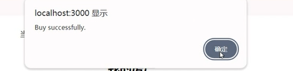

# ZJU-blockchain-course-2024

## 项目介绍

去中心化房屋购买系统 Dapp：

1. 用户查看自己拥有的房产列表。并可以挂单出售自己的房屋（挂单包含价格等信息）。
2. 用户查看所有出售中的房产，并查询一栋房产的主人，及各种挂单信息。
3. 用户可以将测试以太币转换成ERC20积分(RoomToken/RTK)，也可以将积分提取乘以太币。
4. 用户选择支付房屋价格对应的积分，购买某个其他用户出售的房产。购买后房产拥有权应当发生变化。
5. 平台收取手续费：在一个房产出售完成时，用户支付的部分测试以太币（=某栋房产在平台上的挂单时长（timestamp）* 固定比例 * 房产价格）应该被转入合约部署者。

## 如何运行

1. 在本地启动ganache应用，并更改账户私钥到配置文件中。

2. 在 `./contracts` 中安装需要的依赖，运行如下的命令：
    ```bash
    npm install
    ```
3. 在 `./contracts` 中编译合约，运行如下的命令：
    ```bash
    npx hardhat clean
    npx hardhat compile
    ```
4. 在 `./contracts` 中部署合约，运行如下的命令：
    ```bash
   npx hardhat run scripts/deploy.ts
   
   npx hardhat run scripts/deploy.ts --network ganache
   ```
5. 在 `./contracts` 中测试合约， 运行如下的命令：
   ```bash
   npx hardhat test
   ```
6. 在 `./frontend` 中安装需要的依赖，运行如下的命令：
    ```bash
    npm install
    ```
7. 在 `./frontend` 中启动前端程序，运行如下的命令：
    ```bash
    npm run start
    ```
   在浏览器打开`http://localhost:3000`

## 功能实现分析

简单描述：项目完成了要求的哪些功能？每个功能具体是如何实现的？

建议分点列出。

## 项目运行截图

放一些项目运行截图。

1. 部署合约

   添加对应的账户撕咬到配置文件中和浏览器MetaMaks钱包中,在测试网上部署合约，打开前端：

   

2. 连接钱包

    先在MetaMask里面切换到对应的账号，然后点击连接钱包：

    

3. 空投房产

    点击申请空投(一个用户只被允许申请一次)：

    

    系统会给用户空投三套房产

    

    

4. 房产挂单

    点击挂单按钮，输入挂单金额(ERC20 Token数目)

    

    

5. 查看信息

    点击查看信息按钮：

    

6. 兑换RTK

    点击上方兑换积分按钮，输入兑换金额(以太币数量)：

    

    看到测试网中和余额减少：

    

    用户的Room Token积分对应增加：

    

7. 购买房产

    在房产交易部分，点击购买房产：

    

    

    看到消耗了100个RTK，房产已经属于当前用户：

    

    

8. 提取RTK

    点击提取积分，将剩余的RTK提取，输入提取数量：

    

    测试网中对应账户的余额也对应增加：

    

## 参考内容

- 课程的参考Demo见：[DEMOs](https://github.com/LBruyne/blockchain-course-demos)

- 快速实现 ERC721 和 ERC20：[模版](https://wizard.openzeppelin.com/#erc20)。记得安装相关依赖 ``"@openzeppelin/contracts": "^5.0.0"``

- 如何实现ETH和ERC20的兑换？ [参考讲解](https://www.wtf.academy/en/docs/solidity-103/DEX/)
